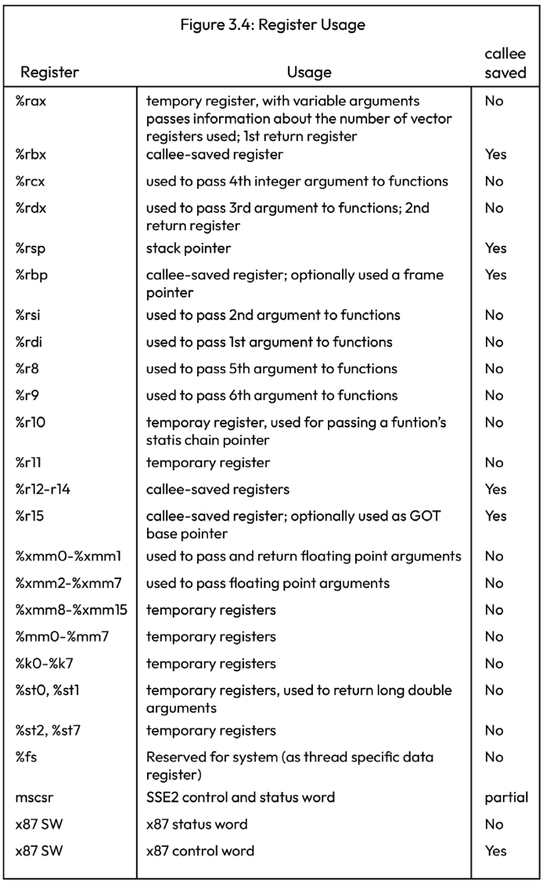

# 异步编程——手搓一个简单的协程玩具

实现目标：在单线程内，通过多个协程发起http请求。
- 单线程
- 在发起IO事件后进行调度

>参考文档
>
>[Asynchronous Programming in Rust](https://www.packtpub.com/product/asynchronous-programming-in-rust/9781805128137)
>
>[Source Code](https://github.com/PacktPublishing/Asynchronous-Programming-in-Rust)
## 前言
- 线程是操作系统的资源，线程的申请和调度依赖于操作系统；
- 协程是用户态的资源，协程的申请和调度依赖与用户态（可以由程序自己进行管理，本质上是程序对自身CPU片段的调度）；
>Q: 为什么会出现程序需要对自身CPU片段进行调度？
>
>Q: 为什么协程能够提高IO吞吐量？


## 简单的协程实现
### 实现效果
>服务端代码
> curl http://127.0.0.1:9091/sleep?mode=random&sleep_time=1000&id=1_1
> 随机休眠[0,1000]ms，id用于标记请求的唯一标识
```rs
mod aruntime;
mod ffi;
// 定义的的异步http库：里面只实现了简陋的http_get方法
mod http;
mod poll;

fn main() {
    let mut runtime = aruntime::Runtime::new();
    runtime.init();
    // ps: "||{}"是rust闭包语法
    runtime.spawn(|| {
        println!("THREAD 1 STARTING");
        let id = 1;
        // 为什么下面有一个一样的host，而不是放在外面？
        let host = "127.0.0.1:9091";
        for i in 0..15 {
            println!("thread: {} counter: {}", id, i);
            let url_path = format!("/sleep?mode=random&id={}_{}&sleep_time=500",id,i);
            match http::http_get(&host,&url_path){
                Ok(resp)=>{
                    println!("REVICE: {}",resp);
                }
                Err(e)=>{
                    println!("ERR: {}",e);
                }
            }
        }
        println!("THREAD 1 FINISHED");
    });

    runtime.spawn(|| {
        println!("THREAD 2 STARTING");
        let id = 2;
        let host = "127.0.0.1:9091";
        for i in 0..15 {
            println!("thread: {} counter: {}", id, i);
            let url_path = format!("/sleep?mode=random&id={}_{}&sleep_time=500",id,i);
            match http::http_get(&host,&url_path){
                Ok(resp)=>{
                    println!("REVICE: {}",resp);
                }
                Err(e)=>{
                    println!("ERR: {}",e);
                }
            }
        }
        println!("THREAD 2 FINISHED");
    });
    runtime.run();
}
```

>`协程执行过程`
>1. 协程内发起非阻塞IO请求(获取到文件描述符fd，调度器向操作系统订阅该fd可读可写事件)
>2. 协程切换到调度器
>3. 调度器将当前协程保存到栈中，并切换到其他协程
>4. 调度器收到事件，唤醒协程
- 实现协程上下文切换；
- 实现非阻塞IO——对接操作系统事件池：epoll(linux), kqueue(mac), IOCP(windows)。
- 一个简陋的调度器；

### 上下文切换
#### PRE-1: 通过指令发起系统调用——给stdout输出字符串
```rs
use std::arch::asm;

fn main() {
    let message = String::from("Hello world from raw syscall!\n");
    syscall(message);
}
#[cfg(target_os = "linux")]
#[inline(never)]
fn syscall(message: String) {
    let msg_ptr = message.as_ptr();
    let len = message.len();

    unsafe {
        asm!(
            "mov rax, 1",      // 系统调用 1 表示linux中的write系统调用
            "mov rdi, 1",      // write的第一个参数，1 表示stdout
            "syscall",         // call kernel, software interrupt
            in("rsi") msg_ptr, // write的第一个参数第二个参数 字符串的指针
            in("rdx") len,     // writed的第二个参数字符串的长度
            out("rax") _, out("rdi") _, lateout("rsi") _, lateout("rdx") _
        );
    }
}
```
#### PRE-2：通过指令实现方法调用
```rs
use core::arch::asm;

const SSIZE: isize = 48;

#[derive(Debug, Default)]
#[repr(C)] // 编译成C语言的结构体
struct ThreadContext {
    rsp: u64,
}

fn hello() -> ! {
    println!("I LOVE WAKING UP ON A NEW STACK!");
    loop {}
}
unsafe fn gt_switch(new: *const ThreadContext) {
    asm!(
        "mov rsp, [{0} + 0x00]",// mov targer,source
        // '[]'表示将内容作为指针处理,'{0}'是format参数，'0'是参数索引
        // rsp 栈指针寄存器
        // ps: rip 指令寄存器/程序计数器，x86 不允许直接操作rip
        "ret",// 将控制权交还给CPU
        in(reg) new, // in(reg) 没有指定寄存器，让编译器自行选择寄存器
    );
}

fn main() {
    let mut ctx = ThreadContext::default();
    let mut stack = vec![0_u8; SSIZE as usize];

    unsafe {
        let stack_bottom = stack.as_mut_ptr().offset(SSIZE);
        // 进行16位对齐
        let sb_aligned = (stack_bottom as usize & !15) as *mut u8;
        std::ptr::write(sb_aligned.offset(-16) as *mut u64, hello as u64);
        ctx.rsp = sb_aligned.offset(-16) as u64;
        // 通过修改栈顶的方式，调用方法
        gt_switch(&mut ctx);
    }
}
```
#### 上下文切换
```rs
#[derive(Debug, Default)]
#[repr(C)] // 编译成C语言的结构体
struct ThreadContext {
    rsp: u64,// 栈指针
    r15: u64,// rbx r12-r15 callee-saved register/被调用者寄存器
    r14: u64,
    r13: u64,
    r12: u64,
    rbx: u64, 
    rbp: u64,
}

#[unsafe(naked)] // 告诉编译器这个函数是裸函数，不需要进行栈帧处理
#[no_mangle] // 告诉编译器不要变更函数名
#[cfg_attr(target_os = "macos", export_name = "\x01switch")]
unsafe extern "C" fn switch() {
    naked_asm!(
        "mov [rdi + 0x00], rsp",
        "mov [rdi + 0x08], r15",
        "mov [rdi + 0x10], r14",
        "mov [rdi + 0x18], r13",
        "mov [rdi + 0x20], r12",
        "mov [rdi + 0x28], rbx",
        "mov [rdi + 0x30], rbp",
        "mov rsp, [rsi + 0x00]",
        "mov r15, [rsi + 0x08]",
        "mov r14, [rsi + 0x10]",
        "mov r13, [rsi + 0x18]",
        "mov r12, [rsi + 0x20]",
        "mov rbx, [rsi + 0x28]",
        "mov rbp, [rsi + 0x30]",
        "ret" 
    );
}
……
unsafe {
    let old: *mut ThreadContext = &mut self.threads[old_pos].ctx;
    let new: *const ThreadContext = &self.threads[pos].ctx;
    // rdi function的第一个参数寄存器
    // rsi function的第二个参数寄存器
    // 用C语言的call指令调用switch函数
    asm!("call switch", in("rdi") old, in("rsi") new, clobber_abi("C"));
}
```


### IO复用:epoll(linux)：单线程内同时发起多个http请求
#### linux接口ffi
```rs
pub const EPOLL_CTL_ADD: i32 = 1;
// 读取事件通知
pub const EPOLLIN: i32 = 0x1;
// 边缘模式下监听事件通知
pub const EPOLLET: i32 = 1 << 31;

#[link(name = "c")]
extern "C" {
    // 创建epoll池
    pub fn epoll_create(size: i32) -> i32;
    // 释放epoll池
    pub fn close(fd: i32) -> i32;
    // 增删改
    pub fn epoll_ctl(epfd: i32, op: i32, fd: i32, event: *mut Event) -> i32;
    // 阻塞当前线程，等待事件发生或超时
    pub fn epoll_wait(epfd: i32, events: *mut Event, maxevents: i32, timeout: i32) -> i32;
}

#[derive(Debug)]
#[repr(C)]
#[cfg_attr(target_arch = "x86_64", repr(packed))]
pub struct Event {
    pub(crate) events: u32,
    pub(crate) epoll_data: usize,
}

impl Event {
    pub fn token(&self) -> usize {
        self.epoll_data
    }
}
```
#### 事件订阅与监听
```rs
type Events = Vec<ffi::Event>;
// 事件注册
pub struct Registry {
    raw_fd: i32,
}

impl Registry {
    // 向epoll订阅source tcp事件的interests
    // 下文中使用ffi::EPOLLIN | ffi::EPOLLET，表示“读”+“边缘事件” = 可读事件
    pub fn register(&self, source: &TcpStream, token: usize, interests: i32) -> Result<()> {
        let mut event = ffi::Event {
            events: interests as u32,
            epoll_data: token,
        };

        let op = ffi::EPOLL_CTL_ADD;
        let res = unsafe { ffi::epoll_ctl(self.raw_fd, op, source.as_raw_fd(), &mut event) };

        if res < 0 {
            return Err(io::Error::last_os_error());
        }
        Ok(())
    }
}

impl Drop for Registry {
    fn drop(&mut self) {
        let res = unsafe { ffi::close(self.raw_fd) };

        if res < 0 {
            let err = io::Error::last_os_error();
            println!("ERROR: {err:?}");
        }
    }
}
// 事件池
pub struct Poll {
    registry: Registry,
}

impl Poll {
    pub fn new() -> Result<Self> {
        // 向操作系统创建一个epoll池
        let res = unsafe { ffi::epoll_create(1) };
        if res < 0 {
            return Err(io::Error::last_os_error());
        }

        Ok(Self {
            registry: Registry { raw_fd: res },
        })
    }

    pub fn registry(&self) -> &Registry {
        &self.registry
    }
    pub fn poll(&mut self, events: &mut Events, timeout: Option<i32>) -> Result<()> {
        let fd = self.registry.raw_fd;
        let timeout = timeout.unwrap_or(-1);
        let max_events = events.capacity() as i32;
        // 等待事件发生或超时
        let res = unsafe { ffi::epoll_wait(fd, events.as_mut_ptr(), max_events, timeout) };

        if res < 0 {
            return Err(io::Error::last_os_error());
        };
        unsafe { events.set_len(res as usize) };
        Ok(())
    }
}

```
#### 发起http请求
```rs
use std::{
    collections::HashSet,
    io::{self, Read, Result, Write},
    net::TcpStream,
    env
};

use ffi::Event;
use poll::Poll;

mod ffi;
mod poll;
// 原始的http请求体
fn get_req(path: &str) -> String {
    format!(
        "GET {path} HTTP/1.1\r\n\
             Host: localhost\r\n\
             Connection: close\r\n\
             \r\n"
    )
}

fn main() -> Result<()> {
    let mut poll = Poll::new()?;
    let n_events = 5;

    let mut streams = vec![];

    let base_url = env::args()
        .nth(1)
        .unwrap_or_else(|| String::from("localhost"));

    let addr = format!("{}:8080", &base_url);

    for i in 0..n_events {
        let delay = (n_events - i) * 1000;
        let url_path = format!("/{delay}/request-{i}");
        // 构造请求提
        let request = get_req(&url_path);
        // 创建tcp请求实例
        let mut stream = std::net::TcpStream::connect(&addr)?;
        // 设置为非阻塞模式
        stream.set_nonblocking(true)?;
        // 非阻塞模式下，写入http请求体数据
        stream.write_all(request.as_bytes())?;
        // 订阅tcp请求的可读事件
        poll.registry()
            .register(&stream, i, ffi::EPOLLIN | ffi::EPOLLET)?;
        // ⚠️：向epoll注册的事件id就是stream在数组中的索引
        streams.push(stream);
    }

    let mut handled_ids = HashSet::new();

    let mut handled_events = 0;
    // 循环等待所有事件处理完成
    while handled_events < n_events {
        let mut events = Vec::with_capacity(10);
        // 等待订阅的事件通知
        poll.poll(&mut events, None)?;

        if events.is_empty() {
            println!("TIMEOUT (OR SPURIOUS EVENT NOTIFICATION)");
            continue;
        }
        handled_events += handle_events(&events, &mut streams, &mut handled_ids)?;
    }

    println!("FINISHED");
    Ok(())
}


fn handle_events(
    events: &[Event],
    streams: &mut [TcpStream],
    handled: &mut HashSet<usize>,
) -> Result<usize> {
    let mut handled_events = 0;
    for event in events {
        let index = event.token();
        let mut data = vec![0u8; 4096];

        loop {
            match streams[index].read(&mut data) {
                Ok(n) if n == 0 => {
                    // 标记已处理事件
                    if !handled.insert(index) {
                        break;
                    }
                    handled_events += 1;
                    break;
                }
                Ok(n) => {
                    // 收到数据
                    let txt = String::from_utf8_lossy(&data[..n]);

                    println!("RECEIVED: {:?}", event);
                    println!("{txt}\n------\n");
                }
                Err(e) if e.kind() == io::ErrorKind::WouldBlock => break,
                // this was not in the book example, but it's a error condition
                // you probably want to handle in some way (either by breaking
                // out of the loop or trying a new read call immediately)
                Err(e) if e.kind() == io::ErrorKind::Interrupted => break,
                Err(e) => return Err(e),
            }
        }
    }

    Ok(handled_events)
}
```
### 上下文切换+IO复用

#### 定义协程抽象
```rs
// 栈大小2M
const DEFAULT_STACK_SIZE: usize = 1024 * 1024 * 2;
// 默认4个协程
const MAX_THREADS: usize = 4;

#[derive(PartialEq, Eq, Debug)]
enum State {
    Available,// 空闲，可用线程
    Running, //正在执行
    Ready, // 允许重新执行
    Pending, // 等待IO就绪
}

struct Thread {
    stack: Vec<u8>,// 栈数据
    ctx: ThreadContext, // 上下文
    state: State, // 协程状态
}
pub struct Runtime {
    threads: Vec<Thread>,// 协程池
    current: usize,// 当前执行中的协程index
    event_poll:poll::Poll,// epoll
}
```
#### 协程池swap
```rs
impl Runtime {
    pub fn spawn(&mut self, f: fn()) {
        // 获取空闲的协程
        let available = self
            .threads
            .iter_mut()
            .find(|t| t.state == State::Available)
            .expect("no available thread.");

        let size = available.stack.len();

        unsafe {
            // 将需要执行的函数入栈
            let s_ptr = available.stack.as_mut_ptr().offset(size as isize);
            let s_ptr = (s_ptr as usize & !15) as *mut u8;
            std::ptr::write(s_ptr.offset(-16) as *mut u64, guard as u64);// 方法执行完成后的钩子：处理协程状态，调度下一个协程
            std::ptr::write(s_ptr.offset(-24) as *mut u64, skip as u64);// 栈信息16位对其
            std::ptr::write(s_ptr.offset(-32) as *mut u64, f as u64);// 需要执行的方法写入协程栈顶
            available.ctx.rsp = s_ptr.offset(-32) as u64;
        }
        available.state = State::Ready;
    }
    fn t_return(&mut self) {
        // 如果当前协程不是base协程，将状态改为Available
        if self.current != 0 {
            self.threads[self.current].state = State::Available;
            self.t_yield();
        }
    }
}
#[unsafe(naked)]
unsafe extern "C" fn skip() {
    naked_asm!("ret")
}
fn guard() {
    unsafe {
        let rt_ptr = RUNTIME as *mut Runtime;
        (*rt_ptr).t_return();
    };
}
```
#### 调度yield
```rs
fn poll_event(&mut self) -> bool{
    if self.threads.iter().all(|s|s.state != State::Pending){
        return false;
    }
    let mut events:Vec<Event> = Vec::with_capacity(MAX_THREADS);
    self.event_poll.poll(&mut events, None).unwrap();// ugly code：遇到异常直接panic
    for event in events {
        let index = event.token();
        self.threads[index].state = State::Ready;
    }
    return true;
}
#[inline(never)]// 告诉编译器不要进行内联优化
fn t_yield(&mut self) -> bool {
    // Robin算法获取下一个可执行的线程
    let (mut pos,mut ok) = self.robin_get_ready_thread();
    if !ok {
        // 没有就绪的线程，等待事件
        if !self.poll_event() {
            // 没有事件需等待
            return false;
        }
        (pos,ok) = self.robin_get_ready_thread();
    }
    if !ok {
        return false;
    }
    // 当前线程为State::Running，将状态改为可执行
    // State::Available 说明线程已执行完成
    // State::Pending 说明线程在等待数据
    if self.threads[self.current].state == State::Running {
        self.threads[self.current].state = State::Ready;
    }
    // 切换线程状态
    self.threads[pos].state = State::Running;
    let old_pos = self.current;
    self.current = pos;

    unsafe {
        let old: *mut ThreadContext = &mut self.threads[old_pos].ctx;
        let new: *const ThreadContext = &self.threads[pos].ctx;
        asm!("call switch", in("rdi") old, in("rsi") new, clobber_abi("C"));
    }
    self.threads.len() > 0
}
```
#### 其他工具方法
```rs

impl Runtime {
    pub fn new() -> Self {
        let base_thread = Thread::new_with_state(State::Running);

        let mut threads = vec![base_thread];
        let mut available_threads: Vec<Thread> = (1..MAX_THREADS).map(|_| Thread::new()).collect();
        threads.append(&mut available_threads);

        Runtime {
            threads,
            current: 0,
            event_poll: poll::Poll::new().unwrap(),// 不推荐的写法，初始化失败直接panic
        }
    }
    pub fn init(&self) {
        unsafe {
            let r_ptr: *const Runtime = self;
            RUNTIME = r_ptr as usize;
        }
    }

    pub fn run(&mut self) -> ! {
        while self.t_yield() {}
        std::process::exit(0);
    }
    // 函数通过静态方法注册并等待tcp链接返回
    // ```rs
    // pub fn async_wait(source: &TcpStream, interests: i32)-> Result<()>{
    //     unsafe {
    //         let rt_ptr = RUNTIME as *mut Runtime;
    //         (*rt_ptr).async_wait(source,interests)?;
    //     };
    //     Ok(())
    // }
    // ```
    pub fn async_wait(&mut self,source: &TcpStream, interests: i32)-> Result<()> {
        self.event_poll.registry().register(source, self.current, interests)?;
        self.threads[self.current].state = State::Pending;
        self.t_yield();
        Ok(())
    }
    // 所有线程均为空
    fn is_all_complated(&self) -> bool{
        self.threads.iter().all(|t| t.state == State::Available)
    }
    fn robin_get_ready_thread(&self) -> (usize,bool){
        let mut pos = self.current;
        while self.threads[pos].state != State::Ready {
            pos += 1;
            if pos == self.threads.len() {
                pos = 0;
            }
            if pos == self.current {
                return (self.current,false);
            }
        }
        return (pos,true);
    }
}
// 中断当前执行协程，并切换到下一个协程
pub fn yield_thread() {
    unsafe {
        let rt_ptr = RUNTIME as *mut Runtime;
        (*rt_ptr).t_yield();
    };
}
```
#### 非阻塞的http get
```rs
fn get_req(path: &str) -> String {
    format!(
        "GET {path} HTTP/1.1\r\n\
             Host: localhost\r\n\
             Connection: close\r\n\
             \r\n"
    )
}

pub fn http_get(addr: &str,path:&str)->Result<String>{
    let request = get_req(&path);
    let mut stream = std::net::TcpStream::connect(addr)?;
    stream.set_nonblocking(true)?;
    stream.write_all(request.as_bytes())?;
    // 向协程注册异步事件
    aruntime::async_wait(&stream, ffi::EPOLLIN | ffi::EPOLLET)?;
    // 事件就绪后继续处理
    let mut data = vec![0u8; 4096];
    let mut res_body = String::new();
    loop {
        match stream.read(&mut data) {
            Ok(n) if n == 0 => {
                break;
            },
            Ok(n) => {
                let txt = String::from_utf8_lossy(&data[..n]);
                res_body.push_str(&txt);
            }
            Err(e) if e.kind() == io::ErrorKind::WouldBlock => break,
            // this was not in the book example, but it's a error condition
            // you probably want to handle in some way (either by breaking
            // out of the loop or trying a new read call immediately)
            Err(e) if e.kind() == io::ErrorKind::Interrupted => break,
            Err(e) => {
                return Err(e);
            }
        }
    }
    return Ok(res_body);
}
```
## 结束

本次实现的调度器中存在众多缺陷，比如：
1. 只在发起异步事件时才进行协程调度；
2. 没有对操作系统异常进行处理；
3. 对于全局唯一的runtime对象，没有进行并发控制。

## 思考题
1. 如果协程执行的方法中使用了死循环，程序会出现什么样的错误，如何改进？
2. 如果协程执行的方法中使用了非定制的阻塞库会发生什么事情？
